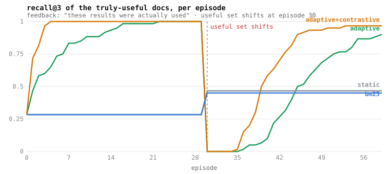

# The adaptive-recall benchmark

One command, fully deterministic, zero dependencies:

```bash
cargo run --release -p psyrag --example adaptive_bench
# writes bench/results.csv + bench/results.svg; --check asserts the claim (runs in CI)
```



## What it measures

The one thing PsyRag claims that static retrieval cannot do: **recall that
improves with use, and re-learns when the world changes**. It is *not* a
general IR benchmark — it isolates the value of a usage-feedback signal when
one exists.

## Setup

- **Corpus**: 20 topics × 8 candidate docs, every candidate lexically
  identical w.r.t. its topic's query (all contain the topic token exactly
  once). For each topic, a hidden 3-of-8 subset is *truly useful*.
  Usefulness is uncorrelated with any token **by construction**: the signal
  exists only in usage, which is precisely the regime where feedback should
  matter and text cannot help.
- **Episodes** (60): retrieve per topic, score **recall@3** and MRR of the
  useful set, then feed back what was used.
- **The feedback is attention-limited, not an oracle**: 20% of sessions give
  no feedback at all; top-3 results are always examined, ranks 4+ only 25%
  of the time; a useful doc is "used" only if it was examined. This is the
  shape of a real citation / click / file-open stream.
- **The shift**: at episode 30 every topic's useful set changes to a
  disjoint one — requirements changed. The adaptive system must notice
  through nothing but its own feedback stream.
- Fixed RNG seed (42), fixed synthetic timestamps: every run reproduces the
  same numbers byte-for-byte, which is why `bench/results.svg` is committed.

## Systems

| system | what it is |
|---|---|
| **adaptive** | PsyRag with the feedback loop on: graded credit (`Credit::Nodes`), homeostat active, consolidation every 8 episodes |
| **static** | ablation — the *same* graph and spreading activation with feedback never applied; isolates learning from structure |
| **bm25** | Okapi BM25 (k1=1.2, b=0.75) over the candidates' token bags — the classic lexical baseline |

Config deltas from defaults, and why: `alpha 0.10` (session-scale learning
rate), `lambda_base 1e-6` (gentle decay so learning, not forgetting,
dominates a one-hour horizon), `theta 0.005` (consolidation squeezes
currently-unused edges but must not *execute* them — a regime shift has to
stay re-learnable; see "what the bench found" below).

## Reading the chart

1. **Learning**: adaptive climbs from the ~0.28 no-signal floor to ~1.0 in
   ~20 episodes. Static and BM25 stay at the floor forever — not because
   they are bad systems, but because the signal is invisible to them.
2. **The crash**: at the shift, adaptive drops to ~0.0 — *below* the static
   floor. That is the honest cost of having learned the old regime: the
   entrenched docs still dominate the ranking.
3. **Re-learning**: recovery to ~0.88 within ~25 episodes, through nothing
   but attention-limited feedback. Recovery is visibly *slower* than initial
   learning — new useful docs start buried and must be discovered through
   occasional deep examinations.

`--check` (run in CI on every push) asserts the final adaptive recall beats
both baselines by ≥0.25 and retains ≥80% of the pre-shift plateau — the
README chart can never silently go stale against the code.

## What the bench found (dynamics notes)

Two real behaviors surfaced while building this, both worth knowing when
tuning a deployment:

- **Prune floors interact with regime shifts.** With the default
  `theta = 0.01`, phase-1 consolidation tombstones the (then-unused) edges
  that the *post-shift* regime needs, and recovery caps out far below the
  pre-shift plateau. Forgetting aggressively is cheap until the world
  changes back.
- **Anti-Hebbian depression can make a shift unrecoverable.** Feeding
  negative credit for examined-but-useless docs (contrastive click
  feedback), combined with per-source renormalization, crushed post-shift
  candidates below the activation floor — they stopped surfacing at all, so
  they could never earn credit again. Tracked as a GitHub issue; candidate
  mitigations include a re-seed floor for alive edges and bounded
  depression.
